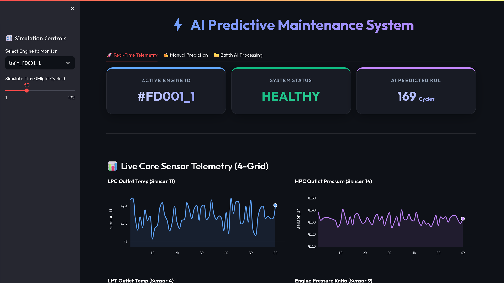
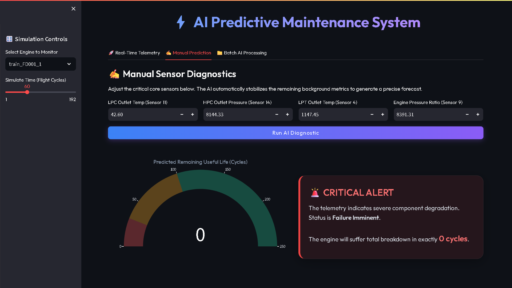
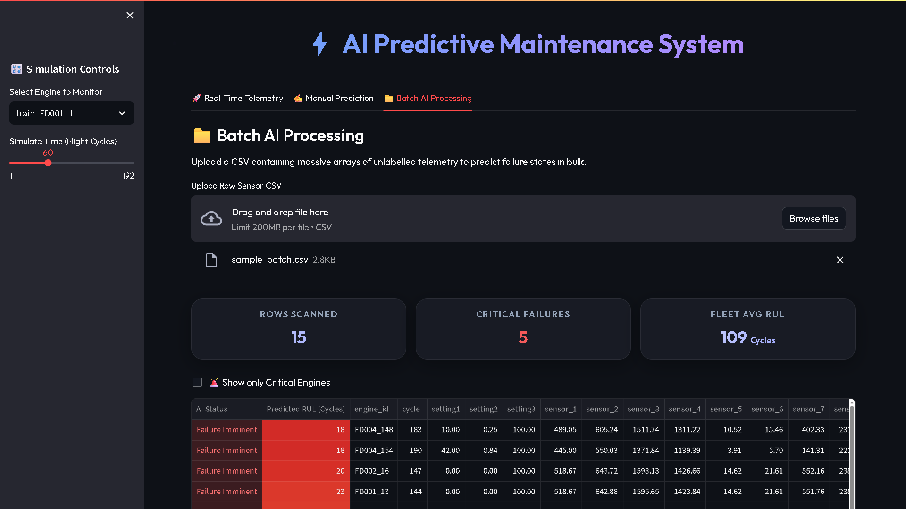
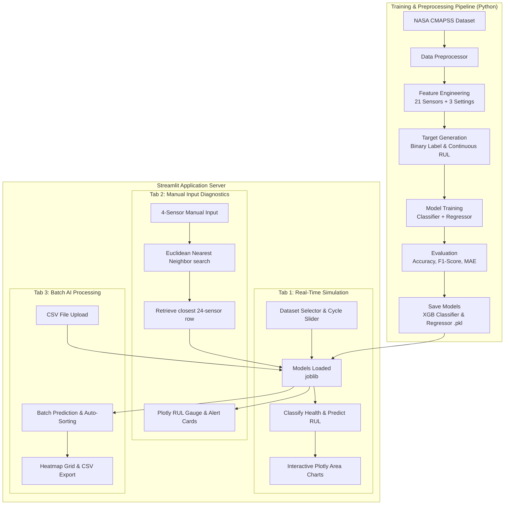

<div align="center">

# AI-Powered Predictive Maintenance for IoT Devices

### Enterprise Industrial IoT Predictive Maintenance Platform

**AI-Powered Equipment Telemetry Dashboard with Real-Time Simulation & Dual-Model Inference**

[](LICENSE)
[]()
[]()
[]()
[]()
[]()
[]()
[]()

---

**AI-Powered Predictive Maintenance for IoT Devices** is an enterprise-grade industrial analytics platform that processes multi-dimensional telemetry streams from IoT sensors to detect anomalies, classify system degradation, and estimate the exact Remaining Useful Life (RUL) of machinery in real-time. Trained on the official **NASA CMAPSS** turbofan dataset, it achieves a **98.54% Accuracy** (F1-Score: **98.24%**) for imminent failure classification and a **45.79 Cycle MAE** for regression, delivering sub-second inference in a clean, interactive dashboard.


**[Launch Live Dashboard (Streamlit Cloud)](https://ai-powered-predictive-maintenance.streamlit.app)**



*Executive Dashboard — Real-time KPIs, 4-grid telemetry charts, and interactive simulation*


</div>

---

## Project Statistics

<div align="center">

| Metric                 | Value                                             |
|------------------------|---------------------------------------------------|
| **Dashboard Tabs**     | 3                                                 |
| **ML Models**          | 2 (Classifier + Regressor)                        |
| **Telemetry Features** | 24 (21 Sensors + 3 Settings)                      |
| **Demo Datasets**      | 13 files (4 Train, 4 Test, 4 RUL, 1 Batch Sample) |
| **Monitored Engines**  | Hundreds of Simulated Turbofans                   |
| **Lines of Python**    | 500+                                              |
| **Inference Engine**   | Dual-Model XGBoost Pipeline                       |
| **Deployment**         | Streamlit Cloud                                   |

</div>

---

## Executive Overview

**AI-Powered Predictive Maintenance for IoT Devices** is a complete enterprise-grade industrial analytics platform designed to solve one of Industry 4.0's most challenging problems: unexpected machinery breakdown. The platform combines supervised machine learning with proximity-based matching algorithms to ingest, validate, and predict equipment failure directly from IoT telemetry streams.

### What It Solves

| Challenge                 | Industry Impact                                        | Project Solution                                            |
|---------------------------|--------------------------------------------------------|-------------------------------------------------------------|
| **Unplanned Downtime**    | Unexpected breakdown costs millions in lost production | Real-time classification flags failures <= 30 cycles        |
| **Premature Maintenance** | Schedule-based replacement discards functional parts   | Regressor forecasts exact RUL to maximize lifespan          |
| **Interface Complexity**  | IoT monitoring requires massive dashboards             | Minimalist 4-dial manual input mapping via Nearest Neighbor |

### Target Users

| User Role                     | Use Case                                                                |
|-------------------------------|-------------------------------------------------------------------------|
| **Maintenance Technicians**   | On-site sensor inspection and instant diagnostics                       |
| **Plant Operations Managers** | Bulk fleet analytics and predictive maintenance scheduling              |
| **Reliability Engineers**     | Telemetry visual correlation, data pipeline auditing, and model testing |

---

## Project Highlights

<div align="center">

|                            |                                |                              |
|:--------------------------:|:------------------------------:|:----------------------------:|
|  **Real-Time Simulation**  | **Nearest Neighbor Matching**  |    **Interactive 4-Grid**    |
| **XGBoost Dual Inference** |    **Batch CSV Processing**    |  **Plotly RUL Gauge Chart**  |
|  **Glassmorphism UI/UX**   | **Auto-Sorted Fleet Priority** | **Streamlit Cloud Deployed** |

</div>

---

## Problem Statement

Industrial operations (aviation, shipping, energy, manufacturing) heavily rely on complex machinery. Traditional maintenance paradigms are inefficient:
- **Reactive Maintenance:** Running equipment to failure causes catastrophic damage, unscheduled downtime, and safety hazards.
- **Preventative Maintenance:** Replacing parts at fixed schedules discards components prematurely, incurring unnecessary replacement costs and operational overhead.
- **IoT Telemetry Overload:** Telemetry arrays produce thousands of columns, drowning engineers in complex data.

**AI-Powered Predictive Maintenance for IoT Devices** addresses these problems by translating raw IoT telemetry into an actionable timeline of equipment health. Using classification to detect the exact 30-cycle emergency window and regression to forecast remaining service cycles, operations transition to a true *predictive maintenance* model.

---

## Key Features

### 📊 Real-Time Telemetry Simulation (Tab 1)
- **Engine Simulation:** Interactive sidebar to select specific engines and scrub through flight cycles to simulate live IoT streaming.
- **Glassmorphism Metrics:** Custom visual KPI cards with dynamic colors indicating status (HEALTHY or FAILURE IMMINENT).
- **Core 4-Grid Charts:** High-performance Plotly charts displaying the core 4 sensors.
- **Aesthetic Refinements:** Translucent area fills under spline-smoothed curves with a dedicated "Live Tracking Blip" on the latest cycle value.

### ✍️ Manual Sensor Diagnostics (Tab 2)
- **Minimalist 4-Input Dial:** Allows engineers to manually inspect a machine by editing only the top 4 predictive sensors:
  1. **LPC Outlet Temperature** (Sensor 11)
  2. **HPC Outlet Pressure** (Sensor 14)
  3. **LPT Outlet Temperature** (Sensor 4)
  4. **Engine Pressure Ratio** (Sensor 9)
- **Euclidean Nearest Neighbor Search:** Maps the user's 4 inputs to the closest historical 24-sensor engine state to guarantee ML accuracy without requiring all 24 inputs.
- **Interactive Gauge Chart:** Plotly gauge with colored alert zones indicating the forecasted breakdown timeline.
- **Custom Alert Cards:** Styled warning cards changing dynamically based on the system status.

### 📁 Batch AI Processing (Tab 3)
- **CSV Drag-and-Drop Uploader:** Ingest massive logs of unlabelled fleet telemetry.
- **Executive Summary Dashboard:** Instantly displays Rows Scanned, Critical Failures, and Fleet Average RUL.
- **Automatic Priority Sorting:** Automatically sorts engines so that machines closest to failure bubble to the top of the table.
- **Precision Formatting:** Rounds all 24 sensors to 2 decimal places for clean data scanning.
- **Heatmap Visualization:** Applies visual gradients across RUL values to highlight emergency states.

---

## Results

<div align="center">

| Achievement                 | Result                               |
|-----------------------------|--------------------------------------|
| **Classification Accuracy** | 98.54%                               |
| **Classification F1-Score** | 98.24%                               |
| **Regression MAE**          | 45.79 Cycles                         |
| **Inference Latency**       | Sub-second                           |
| **Model Types**             | XGBoost Classifier & Regressor       |
| **Datasets Ingested**       | 100% of NASA CMAPSS FD001-FD004 sets |
| **Deployment Platform**     | Streamlit Community Cloud            |

</div>

---

## Screenshots

<div align="center">

### Executive Real-Time Dashboard

*Real-time KPIs, 4-grid telemetry charts, and interactive simulation*

---

### Manual Sensor Diagnostics

*Interactive gauge chart, manual input forms, and dynamic warning cards*

---

### Batch AI Processing

*Fleet-wide CSV file uploader with priority sorting and RUL heatmap gradients*

</div>

---

## Tech Stack

<div align="center">

| Category             | Technologies                                                                            |
|----------------------|-----------------------------------------------------------------------------------------|
| **Frontend UI**      | Streamlit, Custom HTML/CSS (Glassmorphism), Plotly, Font Awesome, Google Fonts (Outfit) |
| **Machine Learning** | XGBoost (Classifier & Regressor), Scikit-Learn                                          |
| **Data Processing**  | Python, Pandas, NumPy, Joblib, Glob                                                     |
| **Deployment**       | Streamlit Community Cloud                                                               |

</div>

---

## System Architecture



---

## Installation & Setup

### Quick Start (Dashboard Only)

To run the Streamlit dashboard locally, make sure you have Python installed and run:

```bash
# Clone the repository
git clone https://github.com/girishshenoy16/AI-Powered-Predictive-Maintenance.git
cd AI-Powered-Predictive-Maintenance

# Create and activate virtual environment
python -m venv venv
.\venv\Scripts\activate   # Windows
source venv/bin/activate  # Linux/Mac

# Upgrade pip
pip install --upgrade pip

# Install dependencies
pip install -r requirements.txt

# Run training pipeline (processes data, trains models, and saves evaluation plots to outputs/)
python main.py

# Start dashboard
streamlit run src/app.py
```

---

## Folder Structure

```
AI-Powered Predictive Maintenance for IoT Devices/
├── data/
│   ├── raw/                 # Raw NASA CMAPSS text files (train_FD*, test_FD*, RUL_FD*)
│   └── processed/           # Processed datasets (train_processed.csv, test_processed.csv)
├── models/                  # Saved XGBoost models (xgb_classifier.pkl, xgb_regressor.pkl)
├── outputs/                 # Evaluation plots (confusion_matrix.png, roc_curve.png, rul_predictions.png)
├── src/
│   ├── app.py               # Streamlit web application & UI
│   ├── preprocess.py        # Data loading, calculation of RUL & failure labels
│   ├── model_trainer.py     # Training and evaluation logic
│   └── create_mock_data.py  # Mock data generator (used for dev/testing)
├── main.py                  # Orchestrator running the end-to-end ML pipeline
├── requirements.txt         # Project dependencies
├── LICENSE                  # MIT License
├── README.md                # Enterprise project documentation
├── REPORT.md                # Global project report
├── task.md                  # Project execution checklist
└── sample_batch.csv         # Generated test file for Batch CSV upload
```

---

## Demo Datasets

| File                 | Rows   | Description                                                                  | Purpose                              |
|----------------------|--------|------------------------------------------------------------------------------|--------------------------------------|
| **sample_batch.csv** | 15     | Shuffled mix of normal and imminent failure rows with RUL and labels removed | Tab 3 CSV Upload validation          |
| **train_FD001.txt**  | 20,631 | Raw CMAPSS dataset under sea-level operating conditions                      | Classification & regression training |
| **test_FD001.txt**   | 13,096 | Raw CMAPSS test telemetry before actual failure                              | Hold-out validation                  |

---

## Contact

<div align="center">

**Girish Shenoy**

[](https://github.com/girishshenoy16)
[](https://linkedin.com/in/girishshenoys)
[](mailto:girishpshenoy09@gmail.com)

</div>

> Open to internships and full-time opportunities in AI, Data Science, Machine Learning, and Industrial IoT Analytics.

---

## License

This project is licensed under the MIT License — see the [LICENSE](LICENSE) file for details.

---

## Acknowledgements

| Resource                                     | Description                                    |
|----------------------------------------------|------------------------------------------------|
| [NASA CMAPSS Dataset](https://www.kaggle.com/datasets/bishals098/nasa-turbofan-engine-degradation-simulation) | Turbofan Engine Degradation Simulation Dataset |
| [XGBoost](https://xgboost.readthedocs.io/)   | High-performance gradient boosting library     |
| [Streamlit](https://streamlit.io/)           | Premium Python web app framework               |
| [Plotly.js](https://plotly.com/)             | Interactivity visualizations and charting      |

---

<div align="center">

**Built with precision. Engineered for reliability. Designed for maintenance operators.**

AI-Powered Predictive Maintenance for IoT Devices v1.0 — Enterprise Industrial IoT Dashboard

</div>
